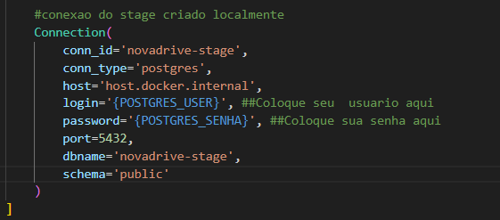
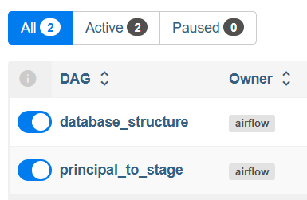
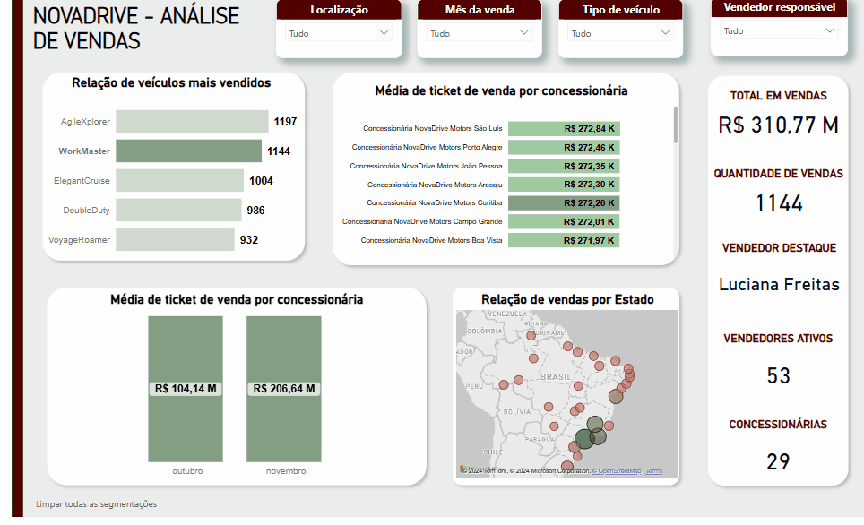

# ND - Orquestração com Airflow, Postgres e DBT
O projeto 'NovaDrive' conta com a orquestração de um Pipeline automatizado para ingestão e armazenamento de dados de uma concessionária fictícia. 
Baseado em um projeto de Engenharia de Dados na [Udemy](https://www.udemy.com/course/bootcamp-engenharia-de-dados/?kw=engenharia+de+dados+bootcamp&src=sac).

### Ferramentas 
Foram utilizados Apache Airflow, Docker, dbt e PostgreSQL.

É necessário ter o [Docker](https://www.docker.com/) instalado na máquina local;

## Arquitetura 
   Fonte de Dados Original (Postgres) --> Airflow (Orquestração) --> Fonte de Dados em Stage (Postgres)
               |--> dbt (Transformações)
               |--> Visualização de Dados (Power BI)

   

## Requisitos
Para conectar ao banco de dados de leitura:
              
## Requisitos - Airflow

Dentro do diretório do *airflow*:

No arquivo *conn.py*, altere suas credenciais locais para a criação do banco:


E em seguida, suba os conteiners:

```
docker-compose up --build
``` 

Acesse o localhost:8080, e execute a dag *database_structure* parar criar o banco de dados e suas tabelas:



É possível executar, no diretório do airflow no terminal, o comando para verificar se foi criado corretamente:

```
docker exec -it airflow-postgres-1 psql -U airflow
```
E execute a dag de *principal_to_stage*!


## Requisitos - DBT
Dentro do diretório *novadrive-project*
```
dbt run
``` 

Para acessar a documentação interativa:
```
dbt docs serve --port 8001
``` 

## Visualização
Para acessar o dashboard, feito em PowerBI, acesse:


[DASH ND](https://app.powerbi.com/view?r=eyJrIjoiMWYwMjZlNWYtMjdiZC00NTc5LWExZTEtMzFmNmUxZThiNTdmIiwidCI6IjdlOTNlMjg2LWIyOWEtNDQ1NC1hNDFhLWU4NDE5ZWM5ZGViNSJ9)

